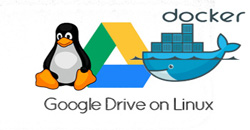

# Sync Google Drive on Linux. Command line + Docker.

An quick and easy docker based solution to backup your data and sync it to the Google Drive.

It will be useful for small and medium on Linux hosted websites.

### Technologies used
* [Official Ruby Docker-Image](https://hub.docker.com/_/ruby)
* [DriveSync script](https://github.com/MStadlmeier/drivesync) - opensource solution, official approved by Google

### System Requirements
* Linux OS with Docker v17+

## Usage
* Clone this repository anywhere to your server.
* In console run ./run_google_divesync.sh

   It runs following steps:
   * create `/Backup/GoogleDrive` - Google Drive dir
   * create `/Backup/conf` - configs and credentials to the googledrive account
   * build of Docker image
   * first run of DriveSync script:
   
   #### Please watch out to the output in console:
   DriveSync will ask open an long url in browser to grant access to your Google Drive. Copy this long url and open in browser, acceppt access, copy code-response and paste it back to the console.

Done! You have grant access and made first synchronization. All entry of `/Backup/GoogleDrive` will be syncroniezed with Google Drive.

What will be backed up to the `/Backup/GoogleDrive` directory - on your decidion.
 
---   
You can set cronjob to run `./run_google_divesync.sh` every day. For example:
```
0 0 * * *  /bin/sh   /path_to_script/run_google_divesync.sh #divesync everyday at 00:00
```
